# Overview

<TODO: complete this with an overview of your project>

## Project Plan

* [Trello Board](https://trello.com/b/XVbjZLDV/azurecicd)
* [Project Planning](https://docs.google.com/spreadsheets/d/138vBDuHU4xuIL37eIoY6uIUCuNEhC95ZWa06nhNH6wA/edit?usp=sharing)

## Instructions

Here is an architectural view of the project
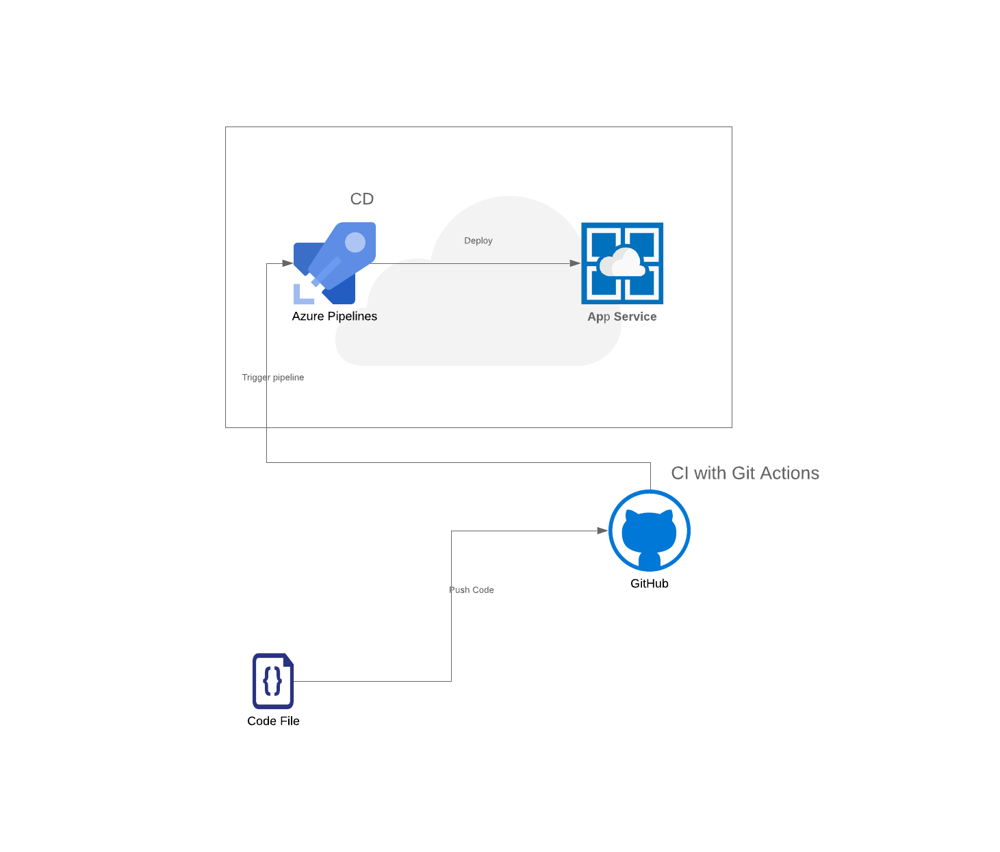

The project can be ran on docker by simply following the below commands. A prequisite fot this is having [docker](https://www.docker.com) installed on your machine.

- cd flask-sklearn
- ./run_docker.sh

If everything runs well then you should see a screen like below(on the right side). And then you can run the below command to make a prediction(sample on the left). 
- ./make_prediction.sh

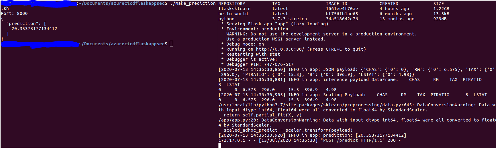

This shows that the project is running just fine.

In order to run the project on Azure Cloud Shell, we need to first of all clone it from the repo using the git clone. But first, in order to avoid entering the username and password each time you want to push your code to the repo, you should set up SSH key n your Github account. 

- git clone "repo link"

A successful clone to cloud shell would be something similar to 
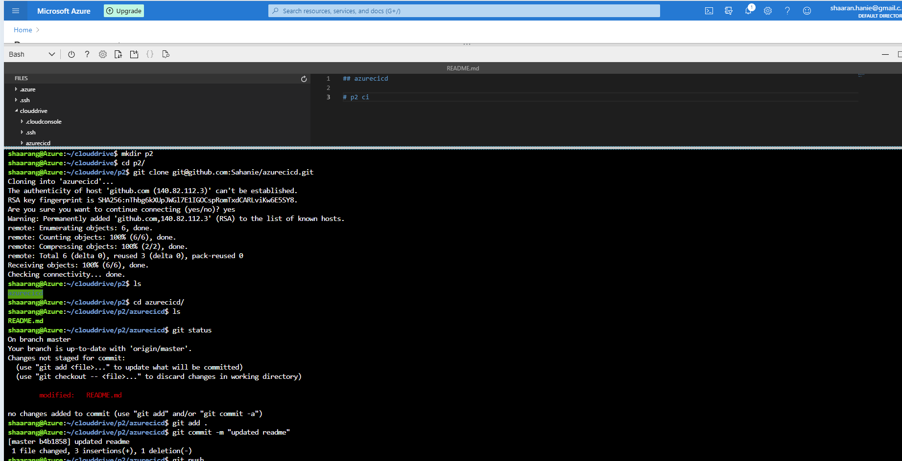

The Makefile contains tests that if passed means that the code can be integrated. After running the Makefile successfully from the shell, it passes
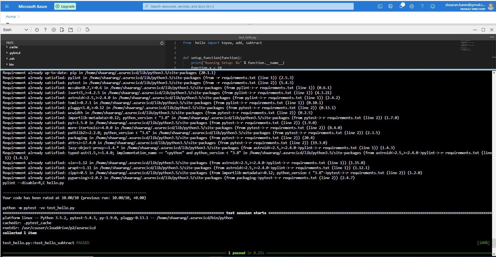

Git actions is configured to do continous integration. It runs the tests that are found in the Makefile. Git action offers a badge which can be included in the readme of the project to show if the test passes or not. A pass test case shows something like

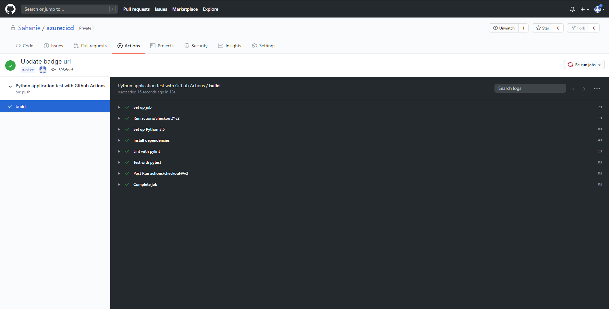

and badge on the readme file:
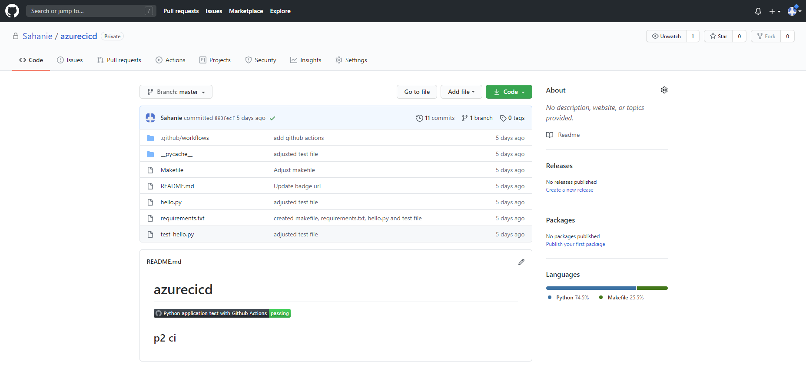

The above steps where for continous integration. Now to continous delivery. Azure Pipelines were used for continous delivery.

An App ervice was created where the deployment of code will be done by the pipeline. The app service can be created by running the `commands.sh`, or simply running `az webapp up -n <app_name>` 
Below is the successfully created app service:
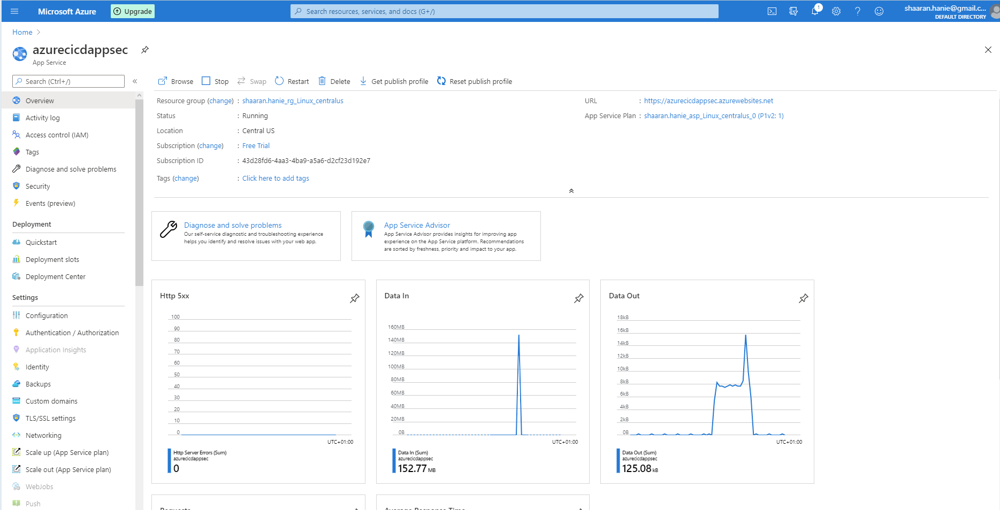

Upon push of code to the github repo, git actions performs the CI and the Azure Pipeline is triggered. Below is a screenshot of Azure pipeline suceesful execution
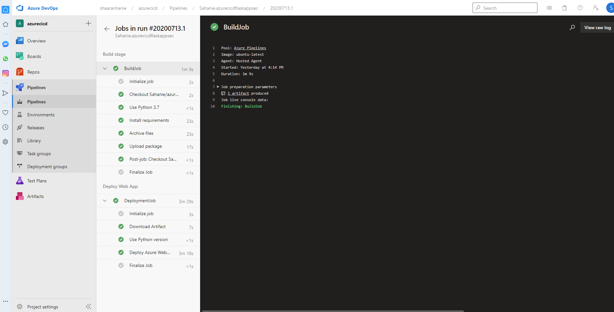

Below is a screenshot showing the project running on app service
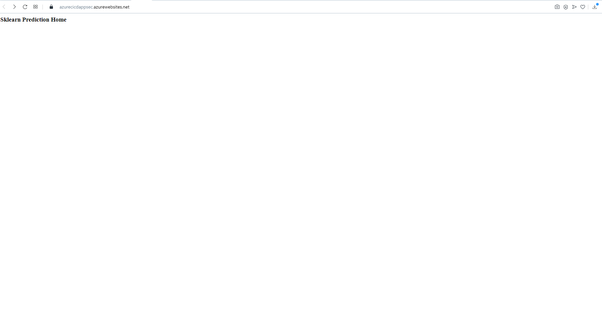

Now we test the prediction by replacing the URL in the `./make_prediction.sh` shell script with the URL of the app service that our code is deployed to and then running the script. Below is a screenshot of a successful execution:
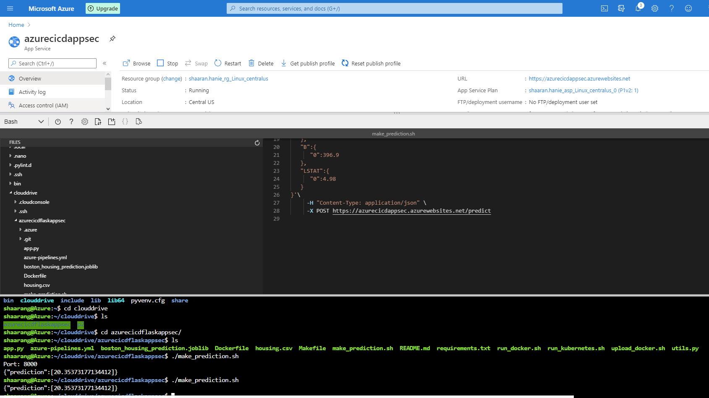

* Passing tests that are displayed after running the `make all` command from the `Makefile`

Now some locust testing on the server. The `locustfile.py` contains the test which was performed on the app on app service. Below is a screenshot showing locust load testing the app.
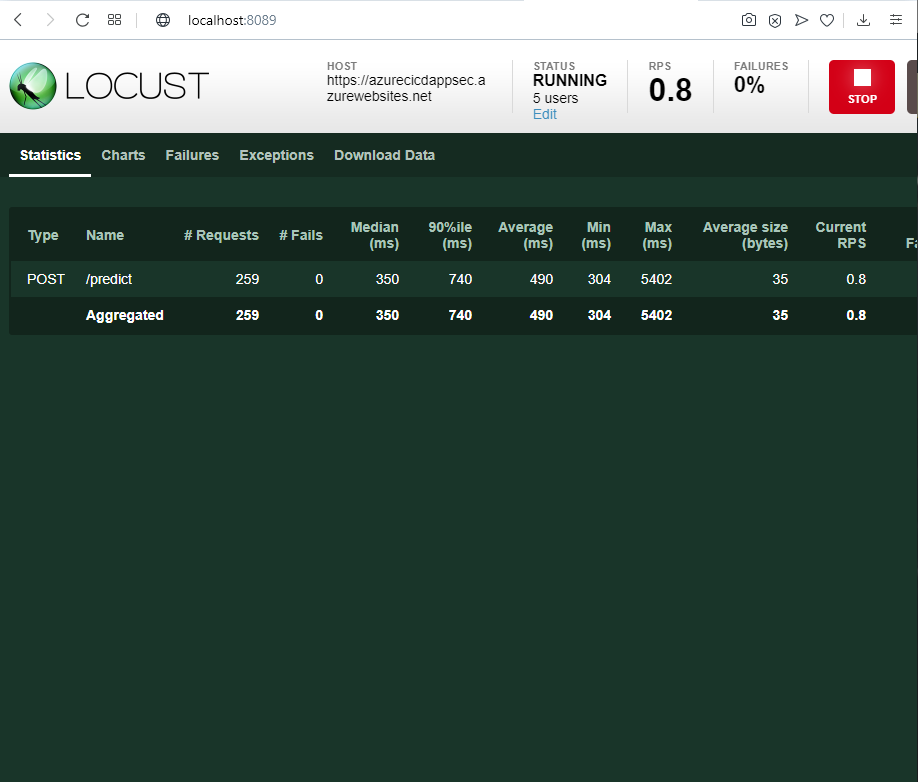

## Enhancements

A possible enhancement here is to build an image of the app and push to an image registry(e.g acr) and then do a containerized deployment. The app could be deployed to a kubernetes cluster.

## Demo 
[https://youtu.be/36Os2j_-os0](https://youtu.be/36Os2j_-os0)

